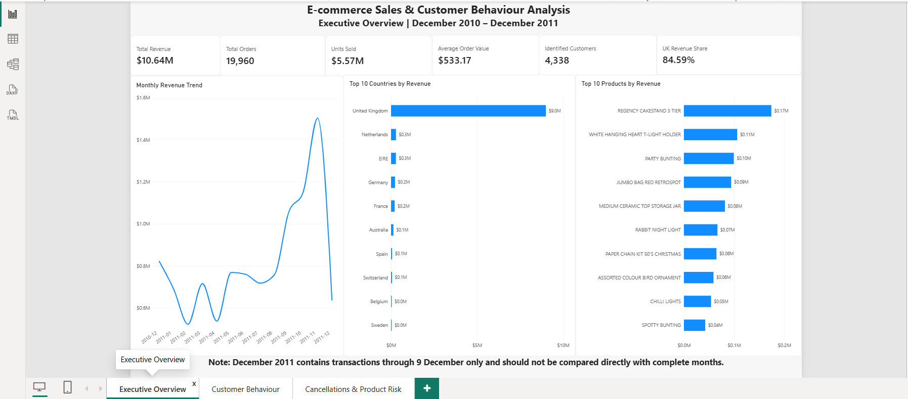
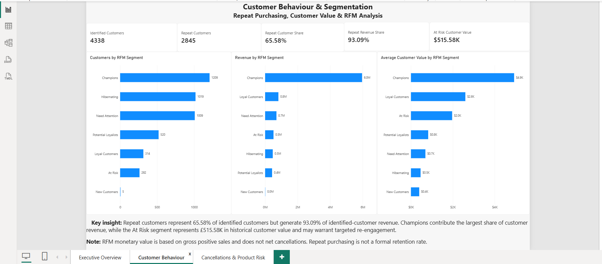
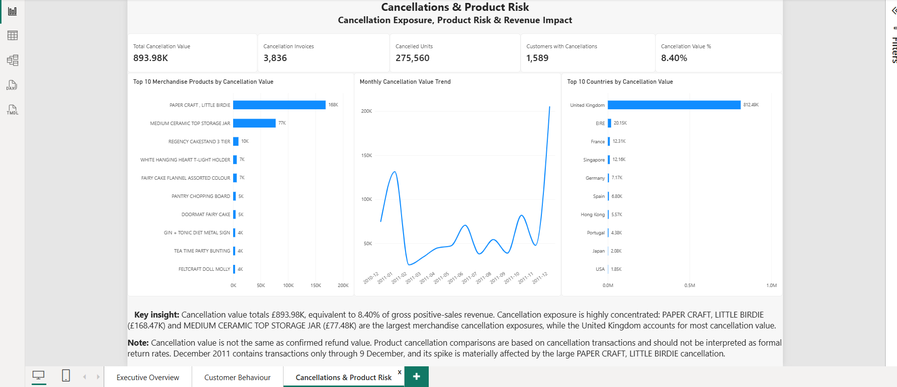

# E-commerce Sales & Customer Behaviour Analysis

## Project Overview

This end-to-end data analytics project analyses transactional data from a UK-based online retailer to understand sales performance, customer purchasing behaviour, product performance, geographic trends, customer value, and cancellation exposure.

The project demonstrates a complete analytics workflow using **Python, MySQL, and Power BI**, progressing from data cleaning and exploratory analysis through advanced SQL customer segmentation and interactive business intelligence reporting.

---

## Business Questions

The analysis was designed to answer the following questions:

- How is revenue performing over time?
- Which products and countries contribute the most revenue?
- How much customer value comes from repeat purchasers?
- Which customers are the most valuable?
- How can customers be segmented using RFM analysis?
- Which customer segments contribute the most revenue?
- What is the scale of cancellation exposure?
- Which products and countries account for the greatest cancellation value?
- What commercial opportunities and risks can management identify from the data?

---

## Tools & Technologies

- **Python** — data cleaning, validation, exploratory analysis and customer analysis
- **Pandas** — data manipulation and aggregation
- **Matplotlib / Seaborn** — exploratory visualisation
- **MySQL** — advanced business analysis and customer segmentation
- **Power BI** — data modelling, DAX measures and interactive dashboards
- **GitHub** — project documentation and version control

### SQL techniques demonstrated

- Common Table Expressions (CTEs)
- Window functions
- `LAG()`
- `RANK()`
- `NTILE()`
- Conditional aggregation
- Date functions
- Customer-level aggregation
- RFM scoring and segmentation

---

## Dataset

The project uses the **Online Retail** dataset from the UCI Machine Learning Repository.

The original dataset contains:

- **541,909 transaction rows**
- **8 original columns**
- Transactions from **1 December 2010 to 9 December 2011**
- Customer, product, quantity, price, invoice and country information

Invoice numbers beginning with `C` represent cancellation transactions.

The original dataset is not stored in this repository due to its size. Dataset details and attribution are available in [`data/README.md`](data/README.md).

---

## Data Cleaning & Preparation

The raw dataset required several data-quality checks before analysis.

Key preparation steps included:

- Removed **5,268 exact duplicate rows**
- Identified cancellation transactions separately from positive sales
- Investigated negative quantities and non-positive prices
- Identified **135,080 rows with missing CustomerID** in the raw data
- Retained valid anonymous sales for overall sales and product analysis
- Excluded missing-customer records from customer-level and RFM analysis
- Created a transaction-level `Revenue` field
- Standardised product codes for product-level analysis
- Separated positive sales and cancellation datasets
- Investigated extreme transaction anomalies before product ranking

After cleaning, the positive-sales dataset contained **524,878 transaction rows**.

---

## Sales Performance

The analysis identified:

| Metric | Result |
|---|---:|
| Gross Positive-Sales Revenue | **£10.64M** |
| Orders | **19,960** |
| Units Sold | **5.57M** |
| Average Order Value | **£533.17** |
| Standardised Product Codes | **3,812** |
| Identified Customers | **4,338** |

Revenue strengthened substantially during the later months of 2011.

Among complete 2011 months:

- **November 2011** generated approximately **£1.50M**, the highest monthly revenue.
- **February 2011** generated approximately **£522.55K**, the lowest complete-month revenue.
- The strong November performance was driven primarily by increased order volume.

> **Important:** December 2011 contains transactions only through **9 December 2011**, so it should not be compared directly with complete months.

---

## Geographic Performance

The **United Kingdom** generated approximately **£9.00M**, representing **84.59% of gross positive-sales revenue**.

International markets contributed a smaller share of total revenue, although several markets displayed substantial average order values.

Leading international markets included:

- Netherlands
- EIRE
- Germany
- France
- Australia

This highlights the retailer's strong dependence on the UK market while also showing meaningful international commercial activity.

---

## Customer Behaviour

Customer-level analysis was performed using the **4,338 customers with identifiable CustomerID values**.

### Repeat purchasing

- **2,845 repeat customers**
- **1,493 one-time customers**
- Repeat customers represented **65.58%** of identified customers.
- Repeat customers generated **93.09%** of identified-customer gross positive-sales revenue.
- Average revenue per repeat customer was approximately **£2,907.99**.
- Average revenue per one-time customer was approximately **£411.25**.

Repeat customers therefore generated approximately **7.07×** the average revenue of one-time customers.

The top 10% of identified customers contributed approximately **61.41%** of identified-customer gross positive-sales revenue, demonstrating substantial customer-value concentration.

> Repeat purchasing is used as a behavioural measure and should not be interpreted as a formal customer retention rate.

---

## RFM Customer Segmentation

RFM analysis was performed in MySQL using:

- **Recency** — days since the customer's most recent positive purchase
- **Frequency** — number of distinct positive-sales invoices
- **Monetary Value** — gross positive-sales revenue generated by the customer

Customers were scored using SQL `NTILE()` window functions and grouped into business-oriented customer segments.

| Customer Segment | Customers | Customer Value |
|---|---:|---:|
| Champions | 1,209 | £5.96M |
| Loyal Customers | 314 | £816.01K |
| Need Attention | 1,009 | £696.74K |
| At Risk | 262 | £515.58K |
| Hibernating | 1,019 | £469.82K |
| Potential Loyalists | 520 | £428.55K |
| New Customers | 5 | £1.98K |

**Champions generated approximately 67.05% of identified-customer gross positive-sales revenue**, making them the dominant customer segment.

The **At Risk** segment represents approximately **£515.58K in historical customer value**, highlighting a potentially important re-engagement opportunity.

> RFM monetary value is based on gross positive sales and does not net cancellation transactions.

---

# Power BI Dashboard

The Power BI report contains three pages designed for different levels of business analysis.

## 1. Executive Overview

The Executive Overview summarises revenue, order volume, units sold, average order value, identified customers, geographic performance and leading products.



### Key insight

The business generated approximately **£10.64M in gross positive-sales revenue**, with the United Kingdom contributing **84.59%** of revenue. Revenue accelerated strongly between September and November 2011.

---

## 2. Customer Behaviour & Segmentation

This dashboard focuses on repeat purchasing, customer value and RFM segmentation.



### Key insight

Repeat customers represent **65.58% of identified customers** but generate **93.09% of identified-customer revenue**.

Champions contribute the largest share of customer value, while the At Risk segment represents **£515.58K in historical customer value** and may warrant targeted re-engagement.

---

## 3. Cancellations & Product Risk

This dashboard analyses cancellation exposure by product, country and time.



### Cancellation overview

| Metric | Result |
|---|---:|
| Cancellation Value | **£893.98K** |
| Cancellation Invoices | **3,836** |
| Cancelled Units | **275,560** |
| Customers Associated with Cancellations | **1,589** |
| Cancellation Value vs Gross Positive-Sales Revenue | **8.40%** |

Cancellation exposure is highly concentrated.

Two notable merchandise cancellation exposures were:

- **PAPER CRAFT, LITTLE BIRDIE — £168.47K**
- **MEDIUM CERAMIC TOP STORAGE JAR — £77.48K**

The PAPER CRAFT transaction was an extreme anomaly: a positive transaction for **80,995 units** was followed by a matching cancellation for the same quantity shortly afterwards.

The United Kingdom accounted for the majority of total cancellation value.

> Cancellation value should not be interpreted as confirmed refund value. Product cancellation comparisons are transaction-based and are not formal return rates.

---

## Business Insights

The analysis highlights several commercially important findings:

1. **Repeat customers drive customer value.**  
   Although repeat customers account for 65.58% of identified customers, they generate 93.09% of identified-customer revenue.

2. **Customer value is highly concentrated.**  
   Champions contribute approximately 67.05% of identified-customer revenue, while the top 10% of customers generate approximately 61.41%.

3. **The UK dominates geographic performance.**  
   Approximately 84.59% of gross positive-sales revenue comes from the United Kingdom.

4. **Late-2011 sales momentum was strong.**  
   September through November showed substantial revenue growth, with November producing the highest complete-month revenue.

5. **Cancellation exposure is concentrated rather than evenly distributed.**  
   A small number of products contribute disproportionately to cancellation value.

6. **High-value customers require contextual analysis.**  
   Large cancelled transactions can inflate gross positive-sales customer value and RFM monetary scores if cancellations are not netted.

---

## Business Recommendations

Based on the analysis, management could consider:

- Developing loyalty and personalised marketing strategies for repeat customers and Champions.
- Creating targeted re-engagement campaigns for the At Risk segment.
- Investigating products with unusually high cancellation exposure.
- Monitoring large or unusual transactions before fulfilment where operationally appropriate.
- Reducing dependence on the UK market by assessing growth opportunities in strong international markets.
- Monitoring seasonal demand and preparing inventory and operational capacity ahead of high-volume periods.
- Incorporating net-sales or matched-return logic into future customer-value modelling where reliable transaction matching is available.

---

## Project Structure

```text
Ecommerce-Sales-Customer-Analysis/
│
├── data/
│   └── README.md
│
├── images/
│   ├── executive_overview.png
│   ├── customer_behaviour.png
│   └── cancellation_product_risk.png
│
├── powerbi/
│   └── ecommerce_sales_customer_analysis.pbix
│
├── python/
│   └── ecommerce_sales_customer_analysis.ipynb
│
├── sql/
│   └── ecommerce_analysis.sql
│
└── README.md
```

---

## Methodology Notes & Limitations

- Revenue reported in this project is **gross positive-sales revenue**, not net revenue.
- Cancellation transactions are analysed separately rather than automatically netted against sales.
- Cancellation value does not necessarily represent confirmed refund value.
- Missing CustomerID transactions are included in valid overall sales analysis but excluded from customer-level analysis.
- RFM monetary value is based on gross positive sales and may therefore be influenced by transactions that were subsequently cancelled.
- December 2011 is a partial month containing data only through **9 December 2011**.
- Product descriptions and product codes contain some inconsistencies in the source data, so product-level comparisons should be interpreted with appropriate data-quality context.

---

## Repository Files

- [`python/ecommerce_sales_customer_analysis.ipynb`](python/ecommerce_sales_customer_analysis.ipynb) — Python data cleaning and exploratory analysis
- [`sql/ecommerce_analysis.sql`](sql/ecommerce_analysis.sql) — MySQL business analysis and RFM segmentation
- [`powerbi/ecommerce_sales_customer_analysis.pbix`](powerbi/ecommerce_sales_customer_analysis.pbix) — Power BI dashboard
- [`data/README.md`](data/README.md) — dataset information and attribution

---

## Dataset Attribution

This project uses the **Online Retail** dataset from the **UCI Machine Learning Repository**.

The dataset is licensed under the **Creative Commons Attribution 4.0 International (CC BY 4.0)** license.

Dataset source:  
https://archive.ics.uci.edu/dataset/352/online+retail

---

## Skills Demonstrated

**Python | Pandas | Data Cleaning | Exploratory Data Analysis | MySQL | Advanced SQL | CTEs | Window Functions | RFM Analysis | Customer Segmentation | Power BI | DAX | Data Modelling | Business Intelligence | Data Visualisation | Business Analysis**
